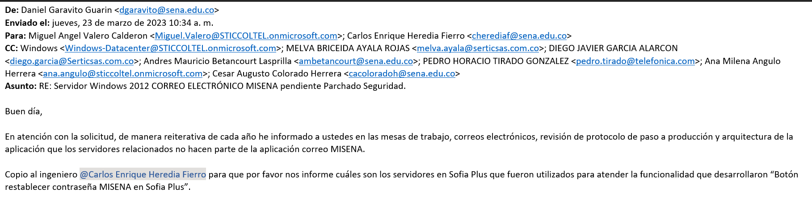

# Correo misena
> Se pidio desconectar los siguientes servidores VSMISENAAPP02	172.29.19.163
VSMISENABD01	172.29.10.183
ya que no hace parte de la infraestructura el dia . 

# PAP Bizagi
[comment]: <Descripcion de la herramienta>
> Es una herramienta en donde cumple el siguiente objetivo 
> Plataforma de implementación y automatización de Procesos
La plataforma cuenta con los siguientes procesos:
BPM - Registro Plan Anual de Adquisiciones y Etapa Inicial del Proceso de Gestión Contractual.
### Categorización de HT: Medio
### Lider funcional: tres (3) LF 
* Jenny Angelica Algarra Caballero Correo jalgarra@sena.edu.co  
* Jared Jafet Forero Alvarez > correo: jfforero@sena.edu.co  
* Javier Armando Cardenas Pena correo : jacardenasp@sena.edu.co  
### Lider tecnico: Uno (1) LT
* Maria Fernanda Solorzano  Correo mfsolorzano@sena.edu.co
### Arquitectura tecnologica: Servicio cloud y base de datos en sql server
### integraciones con: LDAP y Directorio activo.

# Ambientes aprobados

## Desarrollo 
## uno (1) servidor de aplicación
## VSDEAPBIZG01	172.30.176.127
## uno (1) servidor de base de datos
## VSDEBDBZIG01	172.30.162.161
## Capa media: ISS
## Preproducción
## uno (1) servidor de aplicación
## VSPPAPBIZG01	172.30.164.146
## uno (1) servidor de base de datos
## VSPPBDBIZG01	172.31.4.177
## Capa media: ISS
## Producción
## Tener en cuenta que la solucion en produccion se va a encontrar desplegada en la infraestructura nube del proveedor

